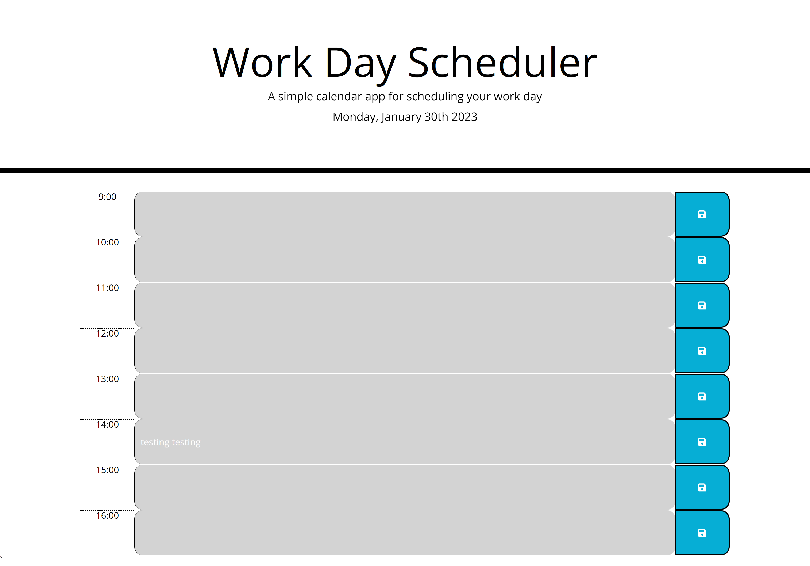

# Daily Planner App

## Description

My motivation for this challenge was to gain a better understanding as to how to use dates and times in Javascript with the moment() API. It was also my first time using jquery and therefore I wanted to try and generate most of the elements dynamically. 

## Table of Contents

- [Installation](#installation)
- [Usage](#usage)
- [Credits](#credits)
- [License](#license)

## Installation

n/a

## Usage
Open the page. 
Past is colour coded grey, present red, future green. 
You can save an appointment by pressing enter or clicking the save button.

[Link to page](https://jxg052.github.io/Daily-Planner-App/)

## Credits

Thanks to edx bootcamp team for providing starter code, DOM links, unwritten functions and mockup.

## License

MIT License

Copyright (c) 2022 JXG052